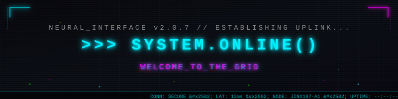
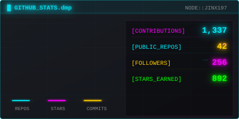
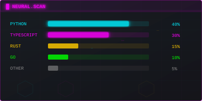
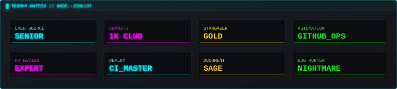
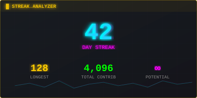
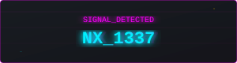

<!-- 终端启动头 -->

 

<!-- 状态徽章 -->

  
  
  

 

<!-- 身份面板 -->

---

  <samp style="color:#00F0FF; font-size: 18px;">◈ ——— CREDENTIALS.ACCESS ——— ◈</samp>

 

  
   
  <samp style="color:#FF00FF;">[ROLE]</samp> Full Stack Developer
   
  <samp style="color:#FF00FF;">[LOC]</samp> The Grid
   
  <samp style="color:#FF00FF;">[MODE]</samp> ACTIVE

 

<!-- 霓虹分割线 -->

  <samp style="color:#FFCC00; font-size: 18px;">◈ ——— NEURAL.STATS ——— ◈</samp>

 

  
  

 

<!-- 霓虹分割线 -->

  <samp style="color:#00F0FF; font-size: 18px;">◈ ——— TECH.IMPLANTS ——— ◈</samp>

 

  
  
  
  
  
  
   
  
  
  
  
   
  
  
  
  
   
  
  
  

 

<!-- 霓虹分割线 -->

  <samp style="color:#FF00FF; font-size: 18px;">◈ ——— NEURAL.PATHWAYS ——— ◈</samp>

 

  

 

  

 

<!-- 霓虹分割线 -->

  <samp style="color:#00FF00; font-size: 18px;">◈ ——— COMM.LINK ——— ◈</samp>

 

  
  
  

 

<!-- 底部 -->

  

   

  

    <samp style="color:#00F0FF;">
      ═══════════════════════════════════════════════════════════════ 
      [ CONNECTION SECURE ]
      &nbsp;···&nbsp;
      [ PING: 13ms ]
      &nbsp;···&nbsp;
      [ UPLINK: STABLE ]
      &nbsp;···&nbsp;
      [ ENCRYPTION: AES-256 ] 
      ═══════════════════════════════════════════════════════════════
    </samp>
  

   

  <samp style="color:#444;">// SIGNAL FOUND · GRID CONNECTED · NEURAL LINK STABLE //</samp>

